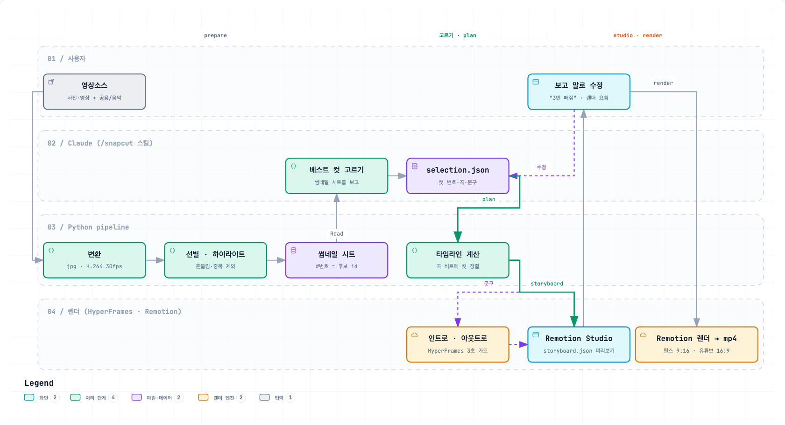

# snapcut

여행·행사 후 쌓인 사진/영상을 음악 비트에 맞춘 추억 뮤비로 자동 편집. Claude Code에서 `/snapcut <영상명>`.

## 설치
터미널에서 한 줄:
```bash
npx github:EM-H20/snapcut
```
(`npx`가 없으면 먼저 `brew install node`.) `~/snapcut`에 내려받고 설치까지 끝낸다. 다른 위치는 `npx github:EM-H20/snapcut ~/원하는/폴더`. 같은 명령을 다시 실행하면 최신 버전으로 업데이트된다.

이미 클론했다면 `./install.sh`. 설치 스크립트가 한 번에 처리한다(여러 번 실행해도 안전).
- ffmpeg·Node 22+·Python 3.13+ 확인 — 없으면 Homebrew로 설치
- Python 가상환경(`.venv`)과 패키지, Remotion(`render/`), HyperFrames 내려받기
- Finder 우클릭 변환 버튼 설치, `공용/음악/`·`projects/` 폴더 생성

필요: macOS, [Homebrew](https://brew.sh)(도구가 없을 때만), [Google Chrome](https://www.google.com/chrome/) 권장, [Claude Code](https://claude.com/claude-code).

렌더링은 설치된 Google Chrome을 사용한다(`render/remotion.config.ts`) — Remotion 번들 브라우저가 일부 Mac에서 실행되지 않기 때문. 다른 Chrome 경로는 `SNAPCUT_CHROME` 환경변수로 지정.

## 사용법

### 1. 재료 넣기
```
snapcut/
├── 공용/음악/                 ← 곡 (mp3/m4a/wav/aac/flac) — 모든 영상이 공유
└── projects/제주여행/
    └── 영상소스/              ← 사진·영상 (jpg/png/heic/mp4/mov, 하위 폴더 가능)
```
- 폴더 이름(`제주여행`)이 영상 이름이 된다. 원본은 절대 수정되지 않는다.
- 아이폰 사진은 사진 앱에서 "수정되지 않은 원본 내보내기"를 쓰면 촬영 시각이 살아 있어 순서가 정확하다. 카톡으로 받은 사진은 촬영 시각이 없어 파일 날짜로 정렬된다.

### 2. Claude Code에서 실행
저장소 폴더에서 Claude Code를 열고:
```
/snapcut 제주여행
```
"제주여행 뮤비 만들어줘"처럼 말로 해도 된다. Claude가 순서대로 진행한다.

1. **준비** — 형식 변환, 흔들린 사진·연사 중복·라이브 포토 영상 제외, 영상 하이라이트 탐색, 썸네일 시트 생성 (사진 수백 장이면 몇 분)
2. **고르기** — Claude가 썸네일 시트를 보고 베스트 컷을 고른다
3. **질문** — 곡, 형식(릴스 / 유튜브 / 둘 다), 타이틀·엔딩 문구를 확인한다
4. **타임라인** — 컷을 비트에 맞춰 배치한다 (`projects/제주여행/selection.json`에 고른 내용이 저장됨)
5. **미리보기** — 브라우저에 Remotion Studio(http://localhost:3000)가 열린다. 렌더 없이 바로 재생된다
6. **렌더** — "둘 다 뽑아줘"라고 하면 완성 영상을 만든다

완성본: `projects/제주여행/output/제주여행_reels.mp4`, `제주여행_youtube.mp4`

### 3. 대화로 고치기
미리보기를 보면서 말로 요청하고, 반영되면 **브라우저를 새로고침**한다.
- "3번 사진 빼줘", "12번이랑 13번 순서 바꿔"
- "후반부 더 빠르게" / "전체적으로 잔잔하게"
- "타이틀을 '우리의 제주'로 바꿔", "엔딩 문구 바꿔"
- "17번 영상은 웃음소리 살려줘" (그 구간만 음악이 줄고 현장 소리가 나온다)
- "다른 곡으로 바꿔줘"

### 4. 확인 없이 한 번에
```
/snapcut 제주여행 --바로
```
릴스·유튜브 둘 다, 지정한 곡(없으면 Claude 추천 곡), Claude가 쓴 문구로 미리보기 없이 렌더까지 간다.

### 5. 형식
| | 릴스 | 유튜브 |
|---|---|---|
| 화면 | 9:16 (1080×1920) | 16:9 (1920×1080) |
| 길이 | 곡의 하이라이트 구간 최대 45초 | 곡 전체 |
| 사진 한 장면 | 약 1초 | 약 2초 |
| 자리가 모자라면 | 균등하게 덜어냄 | 이웃 사진을 2분할 화면으로 묶음 |

장면 길이는 곡의 비트에 맞춰 반올림된다("느리게 해줘" → `photoSeconds`로 조절). 비율이 안 맞는 사진은 흐린 배경 위에 잘리지 않게 놓고, 영상은 검은 여백으로 둔다. 사진이 곡보다 모자라면 음악이 마지막 장면에서 끝난다.

### 변환만 미리 하기
사진을 넣자마자 변환해 두면 나중에 `/snapcut`이 빨라진다. Finder에서 `영상소스`(또는 프로젝트) 폴더 우클릭 → 빠른 동작 → **"snapcut 영상소스 변환"**. 끝나면 알림이 뜨고, 기록은 `~/Library/Logs/snapcut-convert.log`. 변환이 끝나기 전에 `/snapcut`을 같이 돌리지 않는다.

### 명령어로 직접 쓰기
Claude 없이도 각 단계를 실행할 수 있다(저장소 루트에서).
```bash
.venv/bin/python -m pipeline prepare 제주여행
```
| 명령 | 하는 일 |
|---|---|
| `convert <영상명>` | 형식 변환만 |
| `prepare <영상명> [--keep-blur]` | 변환 + 선별 + 하이라이트 + 썸네일 시트(`.cache/sheets/`). `--keep-blur`면 흔들린 사진도 남김 |
| `music` | `공용/음악/` 곡 목록 |
| `plan <영상명>` | `selection.json` → 타임라인(`.cache/storyboard.json`) + 인트로/아웃트로 카드 |
| `studio <영상명>` | 미리보기 열기 |
| `render <영상명> --formats reels,youtube` | 완성 영상 렌더 |

`selection.json`의 `items[].id`는 썸네일 시트의 `#번호`다. **사진을 추가하고 `prepare`를 다시 돌리면 번호가 바뀌므로** 고르기를 다시 해야 한다.

### 문제가 생기면
- **"HDR 영상 N개" 경고** — 아이폰 HDR 영상은 색이 바래 보일 수 있다. 렌더본을 확인하고 이상하면 알려주기.
- **렌더가 실패하고 Chrome 관련 오류** — Google Chrome이 설치돼 있는지 확인. 다른 위치라면 `SNAPCUT_CHROME=/경로/Google Chrome`.
- **빠른 동작 메뉴가 안 보임** — 시스템 설정 → 키보드 → 키보드 단축키 → 서비스(또는 확장 프로그램 → Finder)에서 켜기. 또는 `.venv/bin/python tools/install_quick_action.py` 재실행.
- **곡을 바꿨는데 박자가 이상함** — `projects/<영상명>/.cache/music/`을 지우고 `plan` 다시 실행.

### 빠른 동작 수동 설치 (스크립트가 안 될 때)
Automator → 새 문서 → 빠른 동작 → "작업 흐름이 받는 항목: 폴더 / Finder" → "셸 스크립트 실행"(입력 전달: 인수로) → `tools/install_quick_action.py`의 `SCRIPT` 내용을 붙여넣고 `{ROOT}`·`{LOG}`를 실제 경로로 → 저장 이름 "snapcut 영상소스 변환".

## 동작 원리



(확대·검색이 되는 버전: [docs/how-it-works.html](docs/how-it-works.html)을 내려받아 브라우저로 열기)

**역할 분담이 핵심이다.** Claude는 "무엇을 넣을지"(베스트 컷, 곡, 문구)만 정해 `selection.json`에 적고, "몇 초에 놓을지"는 Python이 곡의 비트로 계산한다. 같은 입력이면 항상 같은 타임라인이 나온다. 원본 `영상소스/`는 읽기만 하고, 모든 중간 결과는 `projects/<영상명>/.cache/`에 쌓인다.

### 1. 변환 — `pipeline/convert.py`
- 사진(HEIC·PNG·JPG)은 EXIF 회전을 적용한 JPG(긴 변 2560px 이하)로, 영상(MOV·MP4)은 H.264 30fps MP4(긴 변 1920px 이하)로 `.cache/media/`에 사본을 만든다. 브라우저(Remotion)가 HEIC와 아이폰 가변 프레임 영상을 안정적으로 못 읽기 때문이다.
- 사본 이름에 원래 확장자를 남긴다(`IMG_1.HEIC` → `IMG_1_heic.jpg`, `IMG_1.MOV` → `IMG_1_mov.mp4`). Live Photo처럼 이름이 같은 파일끼리 덮어쓰지 않게.
- 촬영 시각은 사진 EXIF → 아이폰 영상의 현지 촬영 시각 → 영상 UTC 시각(이 Mac 시간대로 변환) → 파일 날짜 순으로 찾는다.
- `manifest.json`에 원본의 크기·수정 시각을 파일마다 기록해서, 같으면 건너뛰고 중간에 끊겨도 이어서 한다.

### 2. 선별·하이라이트 — `curate.py`, `highlights.py`
- 전체를 촬영 시각순으로 정렬한다.
- **라이브 포토 영상**: 같은 이름의 사진이 있는 3.5초 이하 영상은 뺀다.
- **흔들림**: 선명도(라플라시안 분산)가 전체 중앙값의 10% 미만인 사진을 뺀다(`--keep-blur`면 남김).
- **연사 중복**: 시간상 이웃한 사진의 이미지 지문(perceptual hash) 차이가 작으면 같은 장면으로 보고 가장 선명한 1장만 남긴다.
- **영상 하이라이트**: 장면 전환 지점과, 소리가 평소의 2배 넘게 커지는 구간(웃음·함성)을 찾아 영상마다 최대 4초 구간을 추천한다. 큰 소리 구간이면 현장 소리 살리기(`liveAudio`)를 제안한다.

### 3. 썸네일 시트 → Claude가 고르기 — `contact.py`, `/snapcut` 스킬
- 남은 후보를 5×4 격자 이미지(`.cache/sheets/sheet_01.jpg` …)로 묶고 칸마다 `#번호`를 찍는다. 영상은 `V3s`처럼 길이를 표시한다.
- Claude는 수백 장을 한 장씩 보는 대신 이 시트를 보고 고른다. `#번호`가 곧 `selection.json`의 `id`다.

### 4. 타임라인 계산 — `music.py`, `plan.py`
- **곡 분석**(librosa): BPM, 비트 시각, 마디 첫 박(다운비트)을 찾는다. 릴스는 곡에서 에너지가 가장 큰 45초 구간을 고르되 마디 첫 박에서 시작하게 맞춘다. 유튜브는 곡 전체를 쓴다.
- **배치**: 컷 전환을 비트 위에 놓는다. 사진 한 장면은 목표 길이(유튜브 2초·릴스 1초)를 가장 가까운 비트 수로 반올림하고, 영상은 고른 구간 길이에 맞는 비트 수를 쓴다. 한 비트보다 짧은 영상은 뺀다.
- **넘칠 때**: 유튜브는 이웃한 사진을 2분할 화면으로 필요한 만큼만 묶고, 그래도 넘치면(릴스는 바로) 처음·끝을 살려 균등하게 덜어낸다. **모자랄 때**: 음악을 마지막 장면 + 아웃트로에서 끝낸다.
- **카드**: 인트로·아웃트로는 `공용/인트로아웃트로/<템플릿>/`의 HTML을 HyperFrames로 3초 mp4로 만든다(`basic`, `handwritten`; 배경 영상 선택 가능). 인트로는 첫 비트까지 이어지고, 3초보다 길면 마지막 화면에서 멈춘다.
- 결과는 `.cache/storyboard.json` 한 파일. 장면마다 종류·파일·시작/끝 초가 들어 있다.

### 5. 미리보기·렌더 — `render/` (Remotion)
- Remotion은 `.cache/`를 공개 폴더로 띄우고 `storyboard.json`을 읽어 장면을 그린다. 그래서 plan을 다시 돌리면 Studio에서 **새로고침만 하면** 바뀐 내용이 보인다.
- 사진: 흐린 배경 + 원본 + 천천히 확대·이동(켄 번스). 분할 화면: 칸이 차례로 뜬다. 영상: 고른 구간 재생.
- 음악: 현장 소리 구간에서는 30%로 줄였다가(앞뒤 0.3초에 걸쳐) 돌아오고, 마지막 2초는 페이드아웃.
- `render`는 설치된 Chrome으로 프레임을 합성해 `output/<영상명>_<형식>.mp4`로 내보낸다.

## 라이선스
snapcut 코드는 [MIT](LICENSE).

설치 시 내려받는 도구는 각자의 라이선스를 따른다(이 저장소에 포함되지 않음).
- [Remotion](https://www.remotion.dev/license) — 개인·소규모 팀 무료, 일정 규모 이상 회사는 유료 라이선스 필요
- [HyperFrames](https://github.com/heygen-com/hyperframes) — Apache 2.0
- [GSAP](https://gsap.com/licensing/) — 인트로 카드 애니메이션, CDN에서 로드

넣는 사진·영상·음악의 권리는 사용자에게 있다.

선택: Remotion 공식 Claude 스킬 `npx skills add remotion-dev/skills`.
